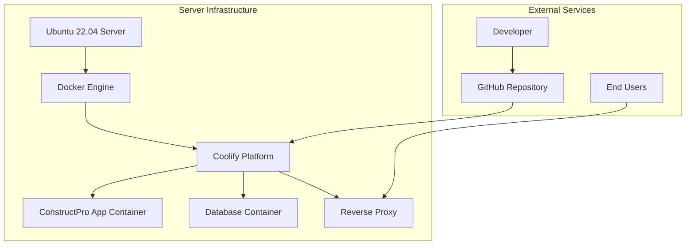
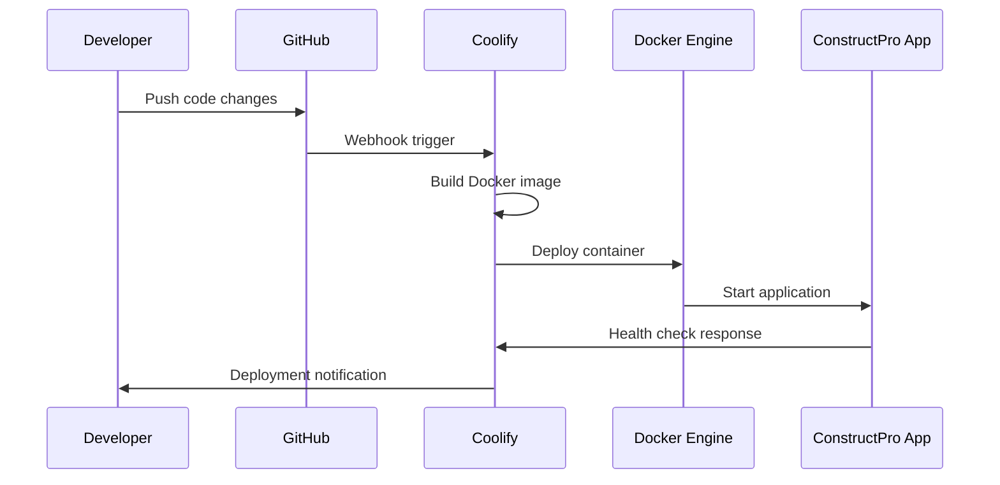

# Design Document

## Overview

Bu design dokümanı, ConstructPro Next.js uygulamasının Coolify platformu üzerinde deploy edilmesi için gerekli tüm teknik adımları ve konfigürasyonları detaylandırır. Mevcut SSH bağlantı sorunları nedeniyle doğrudan sunucu erişimi kullanılarak kurulum yapılacak ve sonrasında tam otomatik deployment pipeline kurulacaktır.

## Architecture

### System Components



### Deployment Flow



## Components and Interfaces

### 1. Server Infrastructure Setup

**Docker Engine Installation**
- Docker CE latest stable version
- Docker Compose v2
- Proper user permissions for docker group
- Systemd service configuration

**System Requirements**
- Minimum 2GB RAM (4GB recommended)
- 20GB free disk space
- Ubuntu 22.04 LTS with latest updates
- Root or sudo access

### 2. SSH Configuration and Troubleshooting

**SSH Service Configuration**
- OpenSSH Server installation and configuration
- Port 22 accessibility
- Key-based authentication setup
- Security hardening

**Firewall Configuration**
- UFW (Uncomplicated Firewall) setup
- Port 22 (SSH) access rules
- Port 80/443 (HTTP/HTTPS) access rules
- Port 8000 (Coolify dashboard) access rules

**Network Diagnostics**
- Connection timeout troubleshooting
- Network interface verification
- Routing table analysis
- DNS resolution checks

### 3. Coolify Platform Installation

**Installation Method**
- Official installation script from coolify.io
- Automated Docker and dependency installation
- SSL certificate generation with Let's Encrypt
- Initial admin user setup

**Configuration Files**
- `/data/coolify/` - Main configuration directory
- SSH key generation and management
- Database initialization (PostgreSQL)
- Reverse proxy configuration (Traefik)

### 4. ConstructPro Application Configuration

**Dockerfile Optimization**
```dockerfile
# Multi-stage build for production optimization
FROM node:18-alpine AS base
FROM base AS deps
FROM base AS builder  
FROM base AS runner
```

**Next.js Configuration**
- Production build optimization
- Static file serving configuration
- API routes configuration
- Environment variable handling

**Environment Variables Management**
- Production database connections
- Authentication secrets
- API keys and external service configurations
- Build-time vs runtime variables

### 5. GitHub Integration

**Repository Setup**
- Webhook configuration for automatic deployments
- Branch protection rules
- Deployment keys management
- CI/CD pipeline triggers

**Deployment Pipeline**
- Automatic build on push to main branch
- Environment-specific deployments
- Rollback capabilities
- Build status notifications

## Data Models

### Coolify Configuration Schema

```typescript
interface CoolifyProject {
  id: string;
  name: string;
  repository: {
    url: string;
    branch: string;
    deployKey: string;
  };
  buildPack: 'dockerfile' | 'nextjs';
  environmentVariables: EnvironmentVariable[];
  domains: Domain[];
  resources: ResourceLimits;
}

interface EnvironmentVariable {
  key: string;
  value: string;
  isSecret: boolean;
  isBuildTime: boolean;
}

interface Domain {
  domain: string;
  isSSL: boolean;
  certificate?: string;
}

interface ResourceLimits {
  memory: string;
  cpu: string;
  storage: string;
}
```

### Deployment Configuration

```typescript
interface DeploymentConfig {
  dockerfile: string;
  buildArgs: Record<string, string>;
  ports: Port[];
  volumes: Volume[];
  healthCheck: HealthCheck;
}

interface Port {
  internal: number;
  external: number;
  protocol: 'tcp' | 'udp';
}

interface Volume {
  source: string;
  target: string;
  type: 'bind' | 'volume';
}

interface HealthCheck {
  path: string;
  interval: number;
  timeout: number;
  retries: number;
}
```

## Error Handling

### SSH Connection Issues
- Connection timeout diagnostics
- Firewall rule verification
- SSH service status checks
- Alternative access methods (console access)

### Docker Installation Failures
- Dependency resolution
- Permission issues
- Storage space verification
- Service startup problems

### Coolify Installation Problems
- Port conflicts resolution
- SSL certificate generation issues
- Database connection problems
- Initial setup failures

### Deployment Failures
- Build process errors
- Environment variable issues
- Resource limitation problems
- Health check failures

## Testing Strategy

### Infrastructure Testing
1. **Server Connectivity Tests**
   - SSH connection verification
   - Port accessibility checks
   - Network latency measurements
   - Firewall rule validation

2. **Docker Installation Verification**
   - Docker daemon status
   - Container creation tests
   - Image pull/push operations
   - Volume mount functionality

3. **Coolify Platform Tests**
   - Dashboard accessibility
   - API endpoint responses
   - Database connectivity
   - SSL certificate validation

### Application Deployment Testing
1. **Build Process Validation**
   - Dockerfile syntax verification
   - Build argument passing
   - Multi-stage build optimization
   - Image size optimization

2. **Runtime Testing**
   - Container startup verification
   - Environment variable loading
   - Database connection tests
   - API endpoint functionality

3. **Integration Testing**
   - GitHub webhook functionality
   - Automatic deployment triggers
   - Rollback mechanism testing
   - Health check monitoring

### Performance and Security Testing
1. **Performance Benchmarks**
   - Application response times
   - Resource utilization monitoring
   - Concurrent user handling
   - Database query performance

2. **Security Validation**
   - SSL certificate verification
   - Environment variable security
   - Container isolation testing
   - Network security scanning

## Implementation Phases

### Phase 1: Server Preparation
- System updates and security hardening
- SSH troubleshooting and configuration
- Firewall setup and port management
- Docker installation and configuration

### Phase 2: Coolify Installation
- Platform installation and initial setup
- SSL certificate configuration
- Admin user creation and security setup
- Basic functionality verification

### Phase 3: Application Configuration
- Dockerfile creation and optimization
- Next.js production configuration
- Environment variables setup
- GitHub repository integration

### Phase 4: Deployment and Testing
- Initial application deployment
- Automated pipeline setup
- Performance optimization
- Monitoring and alerting configuration

### Phase 5: Production Readiness
- Security audit and hardening
- Backup and recovery procedures
- Documentation and runbook creation
- Team training and handover