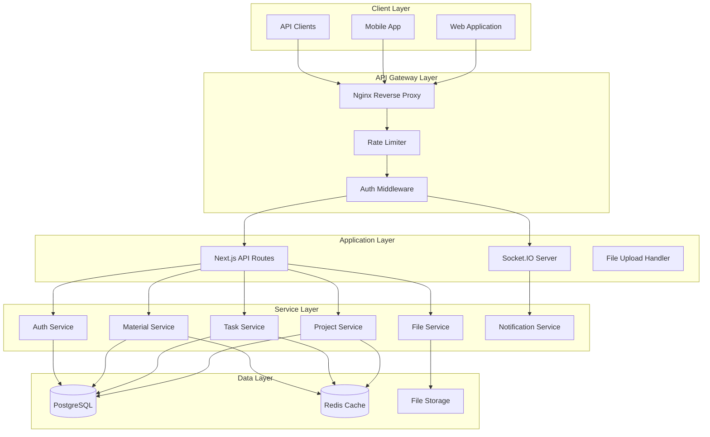
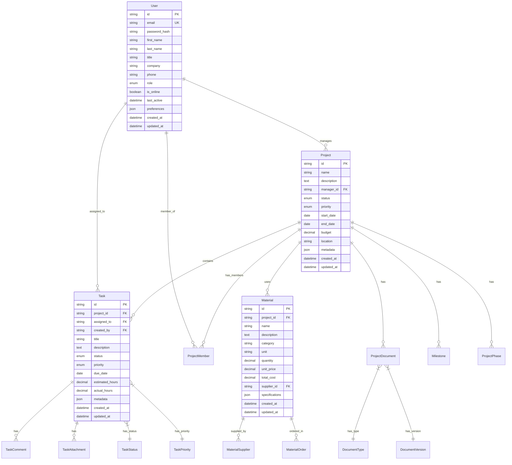
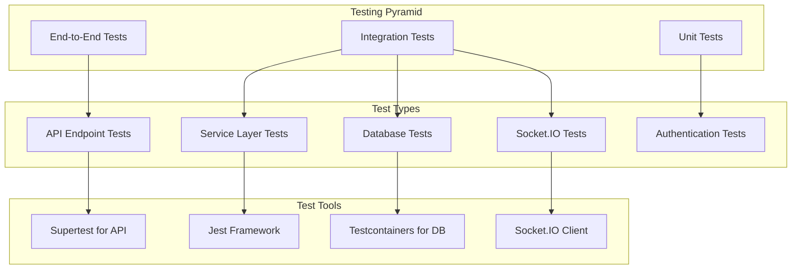

# Design Document

## Overview

This design document outlines the comprehensive backend infrastructure implementation for ConstructPro, transforming it from a development prototype to a production-ready construction project management platform. The design focuses on scalable database architecture, RESTful API implementation, enhanced security, and real-time communication capabilities.

## Architecture

### System Architecture Overview



### Database Architecture

#### PostgreSQL Schema Design



## Components and Interfaces

### API Endpoint Structure

#### Project Management API

```typescript
// Project CRUD Operations
POST   /api/projects                    // Create project
GET    /api/projects                    // List projects with filtering
GET    /api/projects/:id                // Get project details
PATCH  /api/projects/:id                // Update project
DELETE /api/projects/:id                // Delete project

// Project Relations
GET    /api/projects/:id/tasks          // Get project tasks
GET    /api/projects/:id/materials      // Get project materials
GET    /api/projects/:id/documents      // Get project documents
GET    /api/projects/:id/team           // Get project team
GET    /api/projects/:id/milestones     // Get project milestones
GET    /api/projects/:id/stats          // Get project statistics
```

#### Task Management API

```typescript
// Task CRUD Operations
POST   /api/tasks                       // Create task
GET    /api/tasks                       // List tasks with filtering
GET    /api/tasks/:id                   // Get task details
PATCH  /api/tasks/:id                   // Update task
DELETE /api/tasks/:id                   // Delete task

// Task Relations
GET    /api/tasks/:id/comments          // Get task comments
POST   /api/tasks/:id/comments          // Add task comment
GET    /api/tasks/:id/attachments       // Get task attachments
POST   /api/tasks/:id/attachments       // Add task attachment
```

#### Material Management API

```typescript
// Material CRUD Operations
POST   /api/materials                   // Create material
GET    /api/materials                   // List materials with filtering
GET    /api/materials/:id               // Get material details
PATCH  /api/materials/:id               // Update material
DELETE /api/materials/:id               // Delete material

// Material Operations
POST   /api/materials/compare           // Compare materials from suppliers
GET    /api/materials/suppliers         // Get supplier information
POST   /api/materials/orders            // Create material order
```

### Service Layer Architecture

#### Project Service Implementation

```typescript
interface ProjectService {
  // CRUD Operations
  createProject(data: CreateProjectRequest): Promise<Project>
  getProjects(filters: ProjectFilters): Promise<PaginatedResponse<Project>>
  getProject(id: string): Promise<Project>
  updateProject(id: string, data: UpdateProjectRequest): Promise<Project>
  deleteProject(id: string): Promise<void>
  
  // Business Logic
  calculateProjectProgress(id: string): Promise<ProjectProgress>
  getProjectTimeline(id: string): Promise<ProjectTimeline>
  generateProjectReport(id: string): Promise<ProjectReport>
  
  // Team Management
  addTeamMember(projectId: string, userId: string, role: ProjectRole): Promise<void>
  removeTeamMember(projectId: string, userId: string): Promise<void>
  updateMemberRole(projectId: string, userId: string, role: ProjectRole): Promise<void>
}
```

#### Authentication Service Enhancement

```typescript
interface AuthService {
  // Basic Authentication
  login(credentials: LoginRequest): Promise<AuthResponse>
  register(userData: RegisterRequest): Promise<AuthResponse>
  logout(): Promise<void>
  refreshToken(token: string): Promise<AuthResponse>
  
  // Multi-Factor Authentication
  enableMFA(userId: string): Promise<MFASetupResponse>
  verifyMFA(userId: string, code: string): Promise<boolean>
  disableMFA(userId: string, password: string): Promise<void>
  
  // Role-Based Access Control
  assignRole(userId: string, role: UserRole): Promise<void>
  checkPermission(userId: string, resource: string, action: string): Promise<boolean>
  getUserPermissions(userId: string): Promise<Permission[]>
}
```

## Data Models

### Enhanced Database Models

#### User Model Enhancement

```typescript
interface User {
  id: string
  email: string
  passwordHash: string
  firstName?: string
  lastName?: string
  title?: string
  company?: string
  phone?: string
  role: UserRole
  isOnline: boolean
  lastActive: Date
  preferences: UserPreferences
  mfaEnabled: boolean
  mfaSecret?: string
  createdAt: Date
  updatedAt: Date
}

enum UserRole {
  ADMIN = 'ADMIN',
  PROJECT_MANAGER = 'PROJECT_MANAGER',
  SITE_SUPERVISOR = 'SITE_SUPERVISOR',
  WORKER = 'WORKER',
  CLIENT = 'CLIENT',
  SUPPLIER = 'SUPPLIER'
}
```

#### Project Model Enhancement

```typescript
interface Project {
  id: string
  name: string
  description?: string
  managerId: string
  status: ProjectStatus
  priority: ProjectPriority
  startDate: Date
  endDate: Date
  budget: number
  location: string
  metadata: ProjectMetadata
  createdAt: Date
  updatedAt: Date
  
  // Relations
  manager: User
  tasks: Task[]
  materials: Material[]
  documents: ProjectDocument[]
  team: ProjectMember[]
  milestones: Milestone[]
  phases: ProjectPhase[]
}

enum ProjectStatus {
  PLANNING = 'PLANNING',
  IN_PROGRESS = 'IN_PROGRESS',
  ON_HOLD = 'ON_HOLD',
  COMPLETED = 'COMPLETED',
  CANCELLED = 'CANCELLED'
}
```

#### Task Model Enhancement

```typescript
interface Task {
  id: string
  projectId: string
  assignedTo?: string
  createdBy: string
  title: string
  description?: string
  status: TaskStatus
  priority: TaskPriority
  dueDate?: Date
  estimatedHours?: number
  actualHours?: number
  metadata: TaskMetadata
  createdAt: Date
  updatedAt: Date
  
  // Relations
  project: Project
  assignee?: User
  creator: User
  comments: TaskComment[]
  attachments: TaskAttachment[]
}

enum TaskStatus {
  TODO = 'TODO',
  IN_PROGRESS = 'IN_PROGRESS',
  IN_REVIEW = 'IN_REVIEW',
  COMPLETED = 'COMPLETED',
  BLOCKED = 'BLOCKED'
}
```

## Error Handling

### Comprehensive Error Management

```typescript
interface ApiError {
  code: string
  message: string
  statusCode: number
  details?: any
  timestamp: string
  requestId?: string
}

enum ErrorCodes {
  // Authentication Errors
  INVALID_CREDENTIALS = 'INVALID_CREDENTIALS',
  TOKEN_EXPIRED = 'TOKEN_EXPIRED',
  INSUFFICIENT_PERMISSIONS = 'INSUFFICIENT_PERMISSIONS',
  
  // Validation Errors
  VALIDATION_ERROR = 'VALIDATION_ERROR',
  DUPLICATE_ENTRY = 'DUPLICATE_ENTRY',
  INVALID_INPUT = 'INVALID_INPUT',
  
  // Business Logic Errors
  PROJECT_NOT_FOUND = 'PROJECT_NOT_FOUND',
  TASK_ASSIGNMENT_FAILED = 'TASK_ASSIGNMENT_FAILED',
  MATERIAL_OUT_OF_STOCK = 'MATERIAL_OUT_OF_STOCK',
  
  // System Errors
  DATABASE_ERROR = 'DATABASE_ERROR',
  FILE_UPLOAD_FAILED = 'FILE_UPLOAD_FAILED',
  EXTERNAL_SERVICE_ERROR = 'EXTERNAL_SERVICE_ERROR'
}
```

### Error Handling Middleware

```typescript
interface ErrorHandler {
  handleApiError(error: Error, req: Request, res: Response): void
  logError(error: Error, context: string, metadata?: any): void
  notifyAdmins(error: Error, severity: ErrorSeverity): void
}
```

## Testing Strategy

### Testing Architecture



### Test Coverage Requirements

- **Unit Tests**: 90%+ coverage for service layer
- **Integration Tests**: All API endpoints
- **Database Tests**: All CRUD operations and complex queries
- **Authentication Tests**: All auth flows including MFA
- **Socket.IO Tests**: Real-time communication features

## Performance Considerations

### Caching Strategy

```typescript
interface CacheStrategy {
  // Redis Caching
  projectCache: {
    key: `project:${projectId}`
    ttl: 300 // 5 minutes
    invalidateOn: ['project:update', 'project:delete']
  }
  
  userCache: {
    key: `user:${userId}`
    ttl: 600 // 10 minutes
    invalidateOn: ['user:update', 'user:logout']
  }
  
  taskCache: {
    key: `project:${projectId}:tasks`
    ttl: 180 // 3 minutes
    invalidateOn: ['task:create', 'task:update', 'task:delete']
  }
}
```

### Database Optimization

- **Connection Pooling**: PostgreSQL connection pool with 20 max connections
- **Query Optimization**: Indexed queries for frequent lookups
- **Pagination**: Cursor-based pagination for large datasets
- **Read Replicas**: Separate read replicas for reporting queries

### File Storage Strategy

```typescript
interface FileStorageConfig {
  provider: 'AWS_S3' | 'AZURE_BLOB' | 'LOCAL'
  maxFileSize: 50 * 1024 * 1024 // 50MB
  allowedTypes: ['image/*', 'application/pdf', 'application/dwg']
  virusScan: true
  compression: {
    images: true
    documents: false
  }
}
```

## Security Implementation

### Authentication & Authorization

```typescript
interface SecurityConfig {
  jwt: {
    accessTokenExpiry: '15m'
    refreshTokenExpiry: '7d'
    algorithm: 'RS256'
  }
  
  mfa: {
    enabled: true
    issuer: 'ConstructPro'
    window: 1
  }
  
  rateLimit: {
    windowMs: 15 * 60 * 1000 // 15 minutes
    max: 100 // requests per window
    skipSuccessfulRequests: false
  }
  
  cors: {
    origin: process.env.ALLOWED_ORIGINS?.split(',')
    credentials: true
  }
}
```

### Input Validation & Sanitization

```typescript
interface ValidationRules {
  project: {
    name: { required: true, minLength: 3, maxLength: 100 }
    budget: { type: 'number', min: 0, max: 10000000 }
    startDate: { type: 'date', futureOnly: false }
    endDate: { type: 'date', afterStartDate: true }
  }
  
  task: {
    title: { required: true, minLength: 3, maxLength: 200 }
    estimatedHours: { type: 'number', min: 0.5, max: 1000 }
    priority: { enum: ['LOW', 'MEDIUM', 'HIGH', 'URGENT'] }
  }
}
```

This design provides a comprehensive foundation for implementing a production-ready backend infrastructure that can scale with ConstructPro's growth while maintaining security, performance, and reliability standards expected in enterprise construction project management systems.