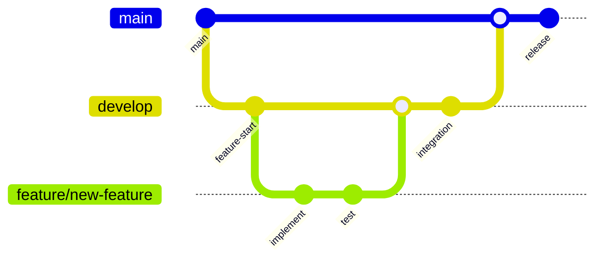
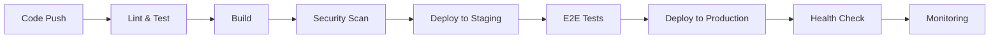

# Design Document

## Overview

This design document outlines the comprehensive restructuring of ConstructPro to transform it into a professional-grade software project. The restructuring focuses on code organization, documentation standardization, development workflow optimization, and deployment pipeline enhancement while maintaining the existing functionality and improving developer experience.

## Architecture

### Current State Analysis

**Strengths:**

- Modern tech stack (Next.js 15, TypeScript, Prisma, Socket.IO)
- Comprehensive UI component library (shadcn/ui)
- Real-time capabilities with Socket.IO
- Construction industry-focused features

**Issues to Address:**

- Multiple redundant documentation files (Turkish/English duplicates)
- Scattered deployment and setup guides
- Inconsistent file organization
- Missing development workflow standards
- Outdated configuration files
- No automated quality assurance

### Target Architecture

```mermaid
graph TB
    subgraph "Project Root"
        A[Essential Config Files]
        B[Single README.md]
        C[Professional Documentation]
    end

    subgraph "Source Code (/src)"
        D[App Router (/app)]
        E[Components (/components)]
        F[Utilities (/lib)]
        G[Hooks (/hooks)]
        H[Types (/types)]
        I[Services (/services)]
    end

    subgraph "Development Tools"
        J[ESLint Config]
        K[Prettier Config]
        L[Husky Hooks]
        M[Testing Setup]
    end

    subgraph "Documentation (/docs)"
        N[API Documentation]
        O[Development Guide]
        P[Deployment Guide]
        Q[Contributing Guide]
    end

    subgraph "CI/CD Pipeline"
        R[GitHub Actions]
        S[Quality Gates]
        T[Automated Testing]
        U[Deployment Automation]
    end
```

## Components and Interfaces

### 1. File System Restructure

#### Files to Remove

- `ADIM_ADIM_BULUT_SUNUCU_REHBERI.md` (Turkish duplicate)
- `TURKCE_BULUT_SUNUCU_KURULUM.md` (Turkish duplicate)
- `TURKCE_WSL2_KURULUM.md` (Turkish duplicate)
- `WSL2_SETUP.md` (Outdated local setup)
- `CLOUD_SERVER_SETUP.md` (Consolidated into main docs)
- `COOLIFY_GITHUB_ENTEGRASYON_REHBERI.md` (Turkish duplicate)
- `coolify-health-check.md` (Consolidated)
- `DURUM_KONTROL_REHBERI.md` (Turkish duplicate)
- `TASK1_QUICK_REFERENCE.md` (Outdated)
- `docker-build-test.md` (Consolidated)
- `security-config.md` (Moved to docs)
- `SERVER_SETUP_GUIDE.md` (Consolidated)
- `CONSTRUCTION_THEME_IMPLEMENTATION.md` (Moved to docs)

#### Files to Consolidate

- All deployment guides → `docs/deployment.md`
- All setup guides → `docs/development-setup.md`
- All troubleshooting → `docs/troubleshooting.md`
- Security configurations → `docs/security.md`

#### New Directory Structure

```
├── docs/                          # Professional documentation
│   ├── api/                      # API documentation
│   ├── development-setup.md      # Complete dev setup guide
│   ├── deployment.md             # Production deployment guide
│   ├── contributing.md           # Contribution guidelines
│   ├── troubleshooting.md        # Comprehensive troubleshooting
│   ├── security.md               # Security best practices
│   └── architecture.md           # System architecture docs
├── src/
│   ├── types/                    # TypeScript type definitions
│   ├── services/                 # Business logic services
│   ├── utils/                    # Utility functions (renamed from lib)
│   └── constants/                # Application constants
├── tests/                        # Test files
│   ├── __mocks__/               # Mock files
│   ├── unit/                    # Unit tests
│   ├── integration/             # Integration tests
│   └── e2e/                     # End-to-end tests
├── .github/                      # GitHub workflows and templates
│   ├── workflows/               # CI/CD workflows
│   ├── ISSUE_TEMPLATE/          # Issue templates
│   └── PULL_REQUEST_TEMPLATE.md # PR template
└── scripts/                      # Build and deployment scripts
```

### 2. Code Quality Infrastructure

#### ESLint Configuration

```typescript
// Enhanced ESLint configuration
{
  "extends": [
    "next/core-web-vitals",
    "@typescript-eslint/recommended",
    "prettier"
  ],
  "rules": {
    "@typescript-eslint/no-unused-vars": "error",
    "@typescript-eslint/explicit-function-return-type": "warn",
    "prefer-const": "error",
    "no-var": "error"
  }
}
```

#### Prettier Configuration

```json
{
  "semi": true,
  "trailingComma": "es5",
  "singleQuote": true,
  "printWidth": 80,
  "tabWidth": 2,
  "useTabs": false
}
```

#### Husky Pre-commit Hooks

- Lint staged files
- Run type checking
- Format code
- Run unit tests

### 3. Enhanced Source Code Organization

#### Type Definitions (`src/types/`)

```typescript
// src/types/index.ts - Centralized type exports
export * from './user.types';
export * from './project.types';
export * from './api.types';
export * from './construction.types';
```

#### Services Layer (`src/services/`)

```typescript
// src/services/api.service.ts - Centralized API calls
// src/services/auth.service.ts - Authentication logic
// src/services/project.service.ts - Project management logic
// src/services/socket.service.ts - Real-time communication
```

#### Constants (`src/constants/`)

```typescript
// src/constants/routes.ts - Application routes
// src/constants/api.ts - API endpoints
// src/constants/construction.ts - Construction-specific constants
```

### 4. Testing Infrastructure

#### Unit Testing Setup

- Jest configuration for unit tests
- React Testing Library for component tests
- Mock service workers for API mocking

#### Integration Testing

- Supertest for API endpoint testing
- Database testing with test containers

#### E2E Testing

- Playwright for end-to-end testing
- Visual regression testing

### 5. Documentation System

#### API Documentation

- OpenAPI/Swagger specification
- Automated API docs generation
- Interactive API explorer

#### Development Documentation

- Comprehensive setup guide
- Architecture decision records (ADRs)
- Code style guidelines
- Component documentation with Storybook

## Data Models

### Enhanced User Model

```typescript
interface User {
  id: string;
  email: string;
  profile: UserProfile;
  preferences: UserPreferences;
  permissions: Permission[];
  constructionRole: ConstructionRole;
  certifications: Certification[];
  projects: ProjectMembership[];
}
```

### Project Management Models

```typescript
interface Project {
  id: string;
  name: string;
  description: string;
  status: ProjectStatus;
  timeline: ProjectTimeline;
  budget: ProjectBudget;
  team: TeamMember[];
  materials: Material[];
  tasks: Task[];
  documents: Document[];
}
```

## Error Handling

### Centralized Error Management

```typescript
// src/utils/error-handler.ts
class ErrorHandler {
  static handle(error: Error, context: string): void;
  static logError(error: Error, metadata: ErrorMetadata): void;
  static createUserFriendlyMessage(error: Error): string;
}
```

### Error Boundaries

- React error boundaries for component-level error handling
- Global error boundary for application-level errors
- API error handling with proper HTTP status codes

### Logging Strategy

- Structured logging with Winston
- Error tracking with Sentry integration
- Performance monitoring with custom metrics

## Testing Strategy

### Testing Pyramid

1. **Unit Tests (70%)**
   - Component testing with React Testing Library
   - Service layer testing with Jest
   - Utility function testing

2. **Integration Tests (20%)**
   - API endpoint testing
   - Database integration testing
   - Service integration testing

3. **E2E Tests (10%)**
   - Critical user journey testing
   - Cross-browser compatibility testing
   - Performance testing

### Test Coverage Requirements

- Minimum 80% code coverage
- 100% coverage for critical business logic
- Visual regression testing for UI components

### Continuous Testing

- Pre-commit hooks run unit tests
- CI pipeline runs full test suite
- Automated testing on pull requests
- Performance regression testing

## Development Workflow

### Git Workflow



### Code Review Process

1. Feature branch creation from develop
2. Implementation with tests
3. Pull request with automated checks
4. Code review by team members
5. Merge to develop after approval
6. Release to main with version tagging

### Quality Gates

- All tests must pass
- Code coverage threshold met
- No ESLint errors
- TypeScript compilation successful
- Security scan passed
- Performance benchmarks met

## Deployment Pipeline

### CI/CD Workflow



### Environment Strategy

- **Development**: Local development with hot reload
- **Staging**: Production-like environment for testing
- **Production**: Optimized production deployment

### Monitoring and Observability

- Application performance monitoring (APM)
- Real-time error tracking
- Infrastructure monitoring
- User analytics and behavior tracking
- Automated alerting for critical issues

## Security Enhancements

### Authentication & Authorization

- JWT token management with refresh tokens
- Role-based access control (RBAC)
- Multi-factor authentication (MFA) support
- Session management with secure cookies

### Data Protection

- Input validation and sanitization
- SQL injection prevention with Prisma
- XSS protection with Content Security Policy
- CSRF protection with tokens
- Rate limiting for API endpoints

### Infrastructure Security

- HTTPS enforcement
- Security headers configuration
- Dependency vulnerability scanning
- Regular security audits
- Secrets management with environment variables

## Performance Optimization

### Frontend Optimization

- Code splitting with dynamic imports
- Image optimization with Next.js Image component
- Bundle size optimization
- Lazy loading for components
- Service worker for caching

### Backend Optimization

- Database query optimization
- Connection pooling
- Caching strategy with Redis
- API response compression
- CDN integration for static assets

### Monitoring and Metrics

- Core Web Vitals tracking
- Database performance monitoring
- API response time tracking
- Memory usage monitoring
- Error rate monitoring
