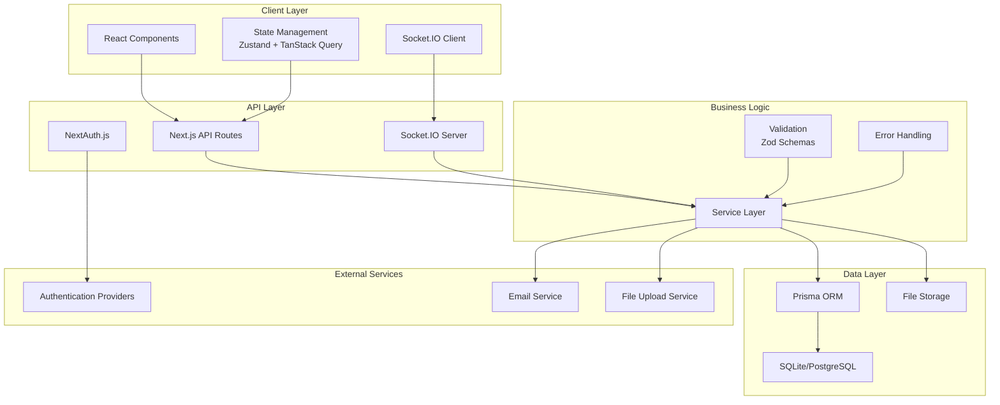
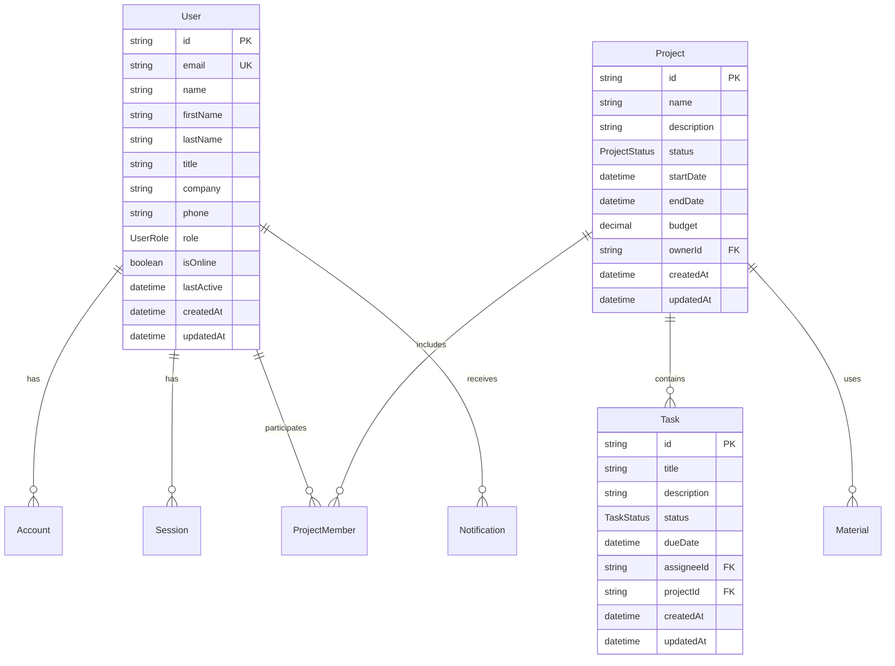
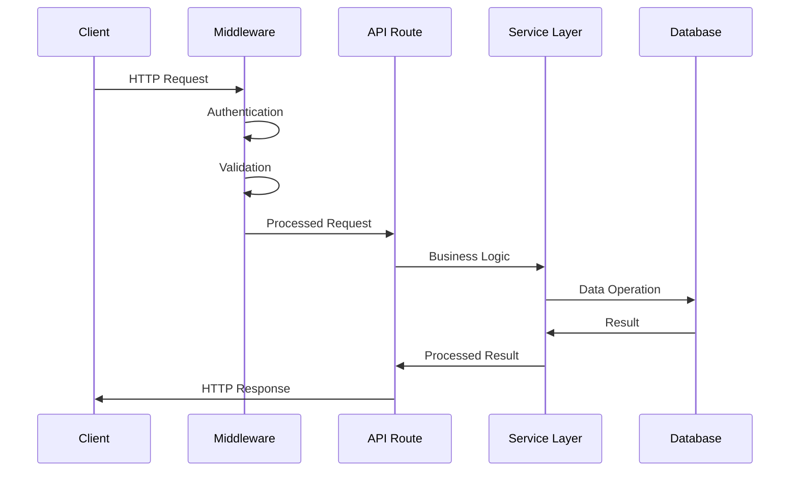
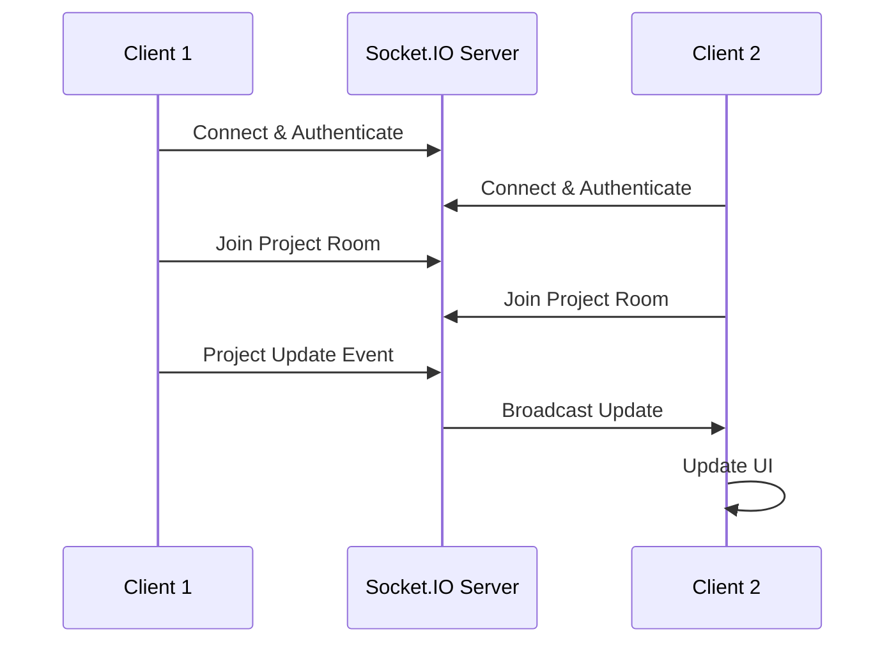
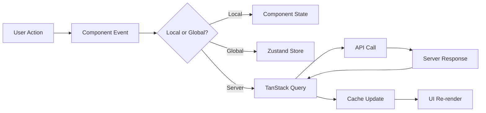

# System Architecture

This document describes the overall architecture of ConstructPro, including system components, data flow, and technical decisions.

## Overview

ConstructPro is built as a modern web application using a full-stack TypeScript architecture with real-time capabilities for construction project management.

## Architecture Diagram



## Technology Stack

### Frontend Architecture

#### React 19 with Next.js 15
- **App Router** - File-based routing with layouts and nested routes
- **Server Components** - Improved performance with server-side rendering
- **Client Components** - Interactive components with state management
- **Streaming** - Progressive page loading for better UX

#### State Management
- **Zustand** - Global state management for application state
- **TanStack Query** - Server state management with caching and synchronization
- **React Hook Form** - Form state management with validation
- **Local State** - Component-level state using React hooks

#### UI Framework
- **shadcn/ui** - Accessible component library built on Radix UI
- **Tailwind CSS** - Utility-first CSS framework
- **Framer Motion** - Animation library for smooth interactions
- **Lucide React** - Consistent icon system

### Backend Architecture

#### API Layer
- **Next.js API Routes** - RESTful API endpoints
- **NextAuth.js** - Authentication and session management
- **Socket.IO** - Real-time bidirectional communication
- **Middleware** - Request/response processing and validation

#### Data Layer
- **Prisma ORM** - Type-safe database operations
- **SQLite** - Development database (lightweight and fast)
- **PostgreSQL** - Production database (scalable and robust)
- **Database Migrations** - Version-controlled schema changes

#### Business Logic
- **Service Layer** - Centralized business logic and operations
- **Validation** - Input validation using Zod schemas
- **Error Handling** - Centralized error management and logging
- **Type Safety** - End-to-end TypeScript type safety

## System Components

### 1. Frontend Components

#### Component Hierarchy
```
App Layout
├── Navigation
├── Sidebar
├── Main Content
│   ├── Page Components
│   ├── Feature Components
│   └── UI Components
├── Modals/Dialogs
└── Toast Notifications
```

#### Key Components
- **ProjectManagement** - Core project management interface
- **UserProfile** - User account and profile management
- **AdminPanel** - Administrative controls and oversight
- **MaterialComparison** - Material sourcing and comparison tools
- **ProfessionalNetwork** - Industry networking features
- **VerificationSystem** - Quality assurance and compliance
- **ARIntegration** - Augmented reality visualization

### 2. API Architecture

#### Route Structure
```
/api/
├── auth/
│   ├── [...nextauth]/route.ts    # NextAuth.js handlers
│   └── session/route.ts          # Session management
├── projects/
│   ├── route.ts                  # List/create projects
│   ├── [id]/route.ts            # Project CRUD operations
│   └── [id]/members/route.ts    # Project member management
├── users/
│   ├── route.ts                  # User operations
│   └── [id]/route.ts            # Individual user operations
└── health/
    └── route.ts                  # Health check endpoint
```

#### Middleware Stack
1. **CORS** - Cross-origin resource sharing configuration
2. **Authentication** - Session validation and user context
3. **Rate Limiting** - Request throttling and abuse prevention
4. **Validation** - Input validation and sanitization
5. **Error Handling** - Centralized error processing
6. **Logging** - Request/response logging and monitoring

### 3. Database Architecture

#### Schema Design


#### Data Access Patterns
- **Repository Pattern** - Abstracted data access layer
- **Query Optimization** - Efficient database queries with proper indexing
- **Connection Pooling** - Optimized database connection management
- **Caching Strategy** - Redis-based caching for frequently accessed data

### 4. Real-time Architecture

#### Socket.IO Implementation
```typescript
// Server-side event handling
io.on('connection', (socket) => {
  // User authentication
  socket.on('authenticate', (token) => {
    // Validate user session
  });

  // Project collaboration
  socket.on('join-project', (projectId) => {
    socket.join(`project-${projectId}`);
  });

  // Real-time updates
  socket.on('project-update', (data) => {
    socket.to(`project-${data.projectId}`).emit('project-updated', data);
  });
});
```

#### Event Types
- **User Events** - Online/offline status, typing indicators
- **Project Events** - Updates, task changes, member additions
- **Notification Events** - Real-time notifications and alerts
- **System Events** - Maintenance notifications, system updates

## Data Flow

### 1. Request Flow



### 2. Real-time Flow



### 3. State Management Flow



## Security Architecture

### Authentication & Authorization
- **NextAuth.js** - Secure authentication with multiple providers
- **JWT Tokens** - Stateless authentication for API access
- **Session Management** - Secure session handling with database storage
- **Role-Based Access Control** - Granular permissions based on user roles

### Data Protection
- **Input Validation** - Comprehensive input sanitization and validation
- **SQL Injection Prevention** - Parameterized queries through Prisma ORM
- **XSS Protection** - Content Security Policy and input sanitization
- **CSRF Protection** - Cross-site request forgery prevention

### Infrastructure Security
- **HTTPS Enforcement** - SSL/TLS encryption for all communications
- **Security Headers** - Comprehensive security headers configuration
- **Rate Limiting** - API abuse prevention and throttling
- **Environment Isolation** - Secure environment variable management

## Performance Architecture

### Frontend Optimization
- **Code Splitting** - Dynamic imports and lazy loading
- **Image Optimization** - Next.js Image component with automatic optimization
- **Bundle Optimization** - Tree shaking and dead code elimination
- **Caching Strategy** - Browser caching and service worker implementation

### Backend Optimization
- **Database Indexing** - Optimized database queries with proper indexes
- **Connection Pooling** - Efficient database connection management
- **Response Caching** - API response caching with Redis
- **CDN Integration** - Content delivery network for static assets

### Monitoring & Observability
- **Performance Monitoring** - Real-time performance metrics and alerts
- **Error Tracking** - Comprehensive error logging and tracking
- **Health Checks** - Automated health monitoring and reporting
- **Analytics** - User behavior and application usage analytics

## Deployment Architecture

### Development Environment
- **Local Development** - Hot reload with nodemon and Next.js
- **Database** - SQLite for lightweight development
- **Environment Variables** - Local environment configuration
- **Testing** - Jest and React Testing Library for unit/integration tests

### Production Environment
- **Container Deployment** - Docker containerization for consistency
- **Database** - PostgreSQL for production scalability
- **Load Balancing** - Nginx reverse proxy with load balancing
- **Process Management** - PM2 for process monitoring and clustering

### CI/CD Pipeline
- **Continuous Integration** - Automated testing and quality checks
- **Continuous Deployment** - Automated deployment to staging and production
- **Quality Gates** - Code coverage, linting, and security scanning
- **Rollback Strategy** - Automated rollback capabilities for failed deployments

## Scalability Considerations

### Horizontal Scaling
- **Stateless Design** - Stateless API design for easy horizontal scaling
- **Load Balancing** - Multiple application instances behind load balancer
- **Database Scaling** - Read replicas and connection pooling
- **Caching Layer** - Redis cluster for distributed caching

### Vertical Scaling
- **Resource Optimization** - Efficient memory and CPU usage
- **Database Optimization** - Query optimization and indexing strategies
- **Connection Management** - Optimized database connection pooling
- **Memory Management** - Proper memory cleanup and garbage collection

### Future Considerations
- **Microservices** - Potential migration to microservices architecture
- **Event Sourcing** - Event-driven architecture for complex workflows
- **CQRS** - Command Query Responsibility Segregation for read/write optimization
- **Message Queues** - Asynchronous processing with message queues

---

This architecture provides a solid foundation for ConstructPro while maintaining flexibility for future growth and feature additions.