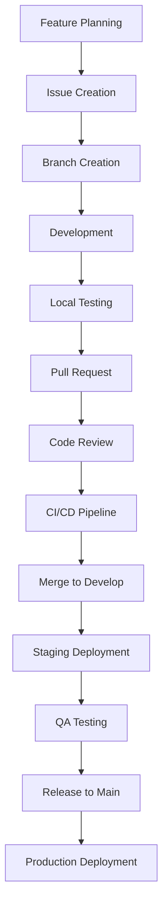

# Development Workflow

## Overview

This document outlines the complete development workflow for the ConstructPro project, from feature planning to production deployment.

## Workflow Stages



## 1. Feature Planning

### Sprint Planning
- **When**: Every 2 weeks
- **Participants**: Product Owner, Tech Lead, Development Team
- **Outcome**: Sprint backlog with prioritized features

### Feature Specification
- Create detailed feature specifications
- Define acceptance criteria
- Estimate effort and complexity
- Identify dependencies and risks

### Technical Design
- Review architectural implications
- Plan database changes
- Consider security requirements
- Design API contracts

## 2. Issue Management

### Issue Creation
```markdown
Title: [TYPE] Brief description
Labels: feature/bug/enhancement, priority, component
Assignee: Developer
Milestone: Sprint X
```

### Issue Types
- **Feature**: New functionality
- **Bug**: Defect fixes
- **Enhancement**: Improvements to existing features
- **Chore**: Maintenance tasks
- **Documentation**: Documentation updates

### Priority Levels
- **P0 - Critical**: Blocks core functionality
- **P1 - High**: Important for user experience
- **P2 - Medium**: Nice to have improvements
- **P3 - Low**: Future considerations

## 3. Branch Management

### Branch Strategy
We use **Git Flow** with the following branches:

- **main**: Production-ready code
- **develop**: Integration branch for features
- **feature/***: Individual feature development
- **hotfix/***: Critical production fixes
- **release/***: Release preparation

### Branch Naming Conventions
```
feature/ISSUE-123-user-authentication
fix/ISSUE-456-login-validation-error
hotfix/ISSUE-789-security-vulnerability
release/v1.2.0
```

### Branch Creation Process
```bash
# Start from develop branch
git checkout develop
git pull origin develop

# Create feature branch
git checkout -b feature/ISSUE-123-user-authentication

# Push branch to remote
git push -u origin feature/ISSUE-123-user-authentication
```

## 4. Development Process

### Development Environment
```bash
# Start development server
npm run dev

# Run tests in watch mode
npm run test:watch

# Run linting
npm run lint
```

### Code Standards
- Follow TypeScript strict mode
- Use ESLint and Prettier configurations
- Write unit tests for new functionality
- Update documentation as needed
- Follow component design patterns

### Commit Guidelines
Use [Conventional Commits](https://www.conventionalcommits.org/) format:

```
<type>[optional scope]: <description>

[optional body]

[optional footer(s)]
```

**Examples:**
```bash
git commit -m "feat(auth): add user login functionality"
git commit -m "fix(api): resolve database connection timeout"
git commit -m "docs: update API documentation"
```

## 5. Testing Strategy

### Test Types
1. **Unit Tests**: Individual component/function testing
2. **Integration Tests**: Component interaction testing
3. **E2E Tests**: Complete user workflow testing
4. **Performance Tests**: Load and performance testing

### Testing Commands
```bash
# Run all tests
npm test

# Run with coverage
npm run test:coverage

# Run specific test suite
npm run test:unit
npm run test:integration
npm run test:e2e
```

### Test Requirements
- Minimum 80% code coverage for new code
- All tests must pass before PR approval
- Critical paths must have E2E test coverage
- Performance tests for major features

## 6. Pull Request Process

### PR Creation
1. **Push your branch** to remote repository
2. **Create PR** using the provided template
3. **Fill out template** completely
4. **Add reviewers** (minimum 1 required)
5. **Link related issues**
6. **Add appropriate labels**

### PR Template Sections
- Description of changes
- Type of change
- Testing performed
- Screenshots (if UI changes)
- Checklist completion

### PR Requirements
- [ ] All CI checks passing
- [ ] Code review approved
- [ ] Tests written and passing
- [ ] Documentation updated
- [ ] No merge conflicts

## 7. Code Review Process

### Review Timeline
- **Initial Review**: Within 24 hours
- **Follow-up Reviews**: Within 12 hours
- **Final Approval**: Same day as last changes

### Review Checklist
- [ ] Code quality and readability
- [ ] Test coverage and quality
- [ ] Security considerations
- [ ] Performance implications
- [ ] Documentation updates
- [ ] Breaking changes assessment

### Review Guidelines
- Be constructive and specific
- Focus on code, not the person
- Suggest improvements with examples
- Approve when ready, request changes when needed

## 8. CI/CD Pipeline

### Continuous Integration
Triggered on every push and PR:

```yaml
# .github/workflows/ci.yml
- Lint and format check
- TypeScript compilation
- Unit and integration tests
- Security audit
- Build verification
- Performance benchmarks
```

### Quality Gates
- All tests must pass
- Code coverage threshold met
- No security vulnerabilities
- Performance benchmarks within limits
- No linting errors

### Automated Checks
- **Pre-commit**: Lint, format, type-check
- **Pre-push**: Tests, build verification
- **CI Pipeline**: Full test suite, security scan
- **Deployment**: Health checks, rollback capability

## 9. Deployment Process

### Staging Deployment
- **Trigger**: Merge to develop branch
- **Environment**: staging.constructpro.com
- **Purpose**: QA testing and stakeholder review
- **Rollback**: Automatic on health check failure

### Production Deployment
- **Trigger**: Merge to main branch
- **Environment**: constructpro.com
- **Process**: Blue-green deployment
- **Monitoring**: Real-time health checks
- **Rollback**: One-click rollback capability

### Deployment Commands
```bash
# Deploy to staging
npm run deploy:staging

# Deploy to production
npm run deploy:production

# Rollback deployment
npm run deploy:rollback
```

## 10. Release Management

### Release Planning
- **Frequency**: Bi-weekly releases
- **Planning**: Sprint planning meetings
- **Documentation**: Release notes and changelog
- **Communication**: Stakeholder notifications

### Release Process
1. **Code Freeze**: 24 hours before release
2. **Final Testing**: Comprehensive QA testing
3. **Release Branch**: Create from develop
4. **Version Bump**: Update package.json version
5. **Tag Release**: Git tag with version number
6. **Deploy**: Production deployment
7. **Monitor**: Post-deployment monitoring

### Versioning
We follow [Semantic Versioning](https://semver.org/):
- **MAJOR**: Breaking changes
- **MINOR**: New features (backward compatible)
- **PATCH**: Bug fixes (backward compatible)

## 11. Hotfix Process

### When to Use Hotfixes
- Critical security vulnerabilities
- Production-breaking bugs
- Data corruption issues
- Service outages

### Hotfix Workflow
```bash
# Create hotfix branch from main
git checkout main
git pull origin main
git checkout -b hotfix/critical-security-fix

# Make minimal changes
# Test thoroughly
# Create PR to main (expedited review)
# Deploy immediately after merge
# Cherry-pick to develop branch
```

## 12. Monitoring and Maintenance

### Performance Monitoring
- Application performance metrics
- Database query performance
- API response times
- User experience metrics

### Error Tracking
- Real-time error monitoring
- Error rate alerts
- Performance degradation alerts
- Security incident alerts

### Maintenance Tasks
- **Daily**: Monitor dashboards, review alerts
- **Weekly**: Dependency updates, security scans
- **Monthly**: Performance reviews, capacity planning
- **Quarterly**: Architecture reviews, tech debt assessment

## 13. Documentation Requirements

### Code Documentation
- JSDoc comments for public APIs
- README files for complex modules
- Architecture decision records (ADRs)
- Database schema documentation

### Process Documentation
- Keep workflow documentation updated
- Document deployment procedures
- Maintain troubleshooting guides
- Update onboarding materials

## 14. Quality Metrics

### Development Metrics
- **Lead Time**: Idea to production
- **Cycle Time**: Development to deployment
- **Deployment Frequency**: How often we deploy
- **Mean Time to Recovery**: Time to fix issues

### Quality Metrics
- **Code Coverage**: Percentage of code tested
- **Defect Rate**: Bugs per feature
- **Performance**: Response times and throughput
- **Security**: Vulnerability count and resolution time

## 15. Tools and Integrations

### Development Tools
- **IDE**: VS Code with extensions
- **Version Control**: Git with GitHub
- **Package Manager**: npm
- **Build Tool**: Next.js build system

### Quality Tools
- **Linting**: ESLint
- **Formatting**: Prettier
- **Type Checking**: TypeScript
- **Testing**: Jest, React Testing Library
- **Security**: npm audit, Snyk

### Deployment Tools
- **CI/CD**: GitHub Actions
- **Containerization**: Docker
- **Monitoring**: Custom monitoring scripts
- **Error Tracking**: Built-in error handling

## Best Practices Summary

### Development
- Write clean, readable code
- Test early and often
- Follow established patterns
- Document complex logic
- Consider security implications

### Collaboration
- Communicate changes clearly
- Review code thoroughly
- Share knowledge actively
- Help team members grow
- Maintain positive culture

### Process
- Follow workflow consistently
- Automate repetitive tasks
- Monitor and improve metrics
- Learn from incidents
- Celebrate successes

This workflow ensures high-quality software delivery while maintaining team productivity and code maintainability.